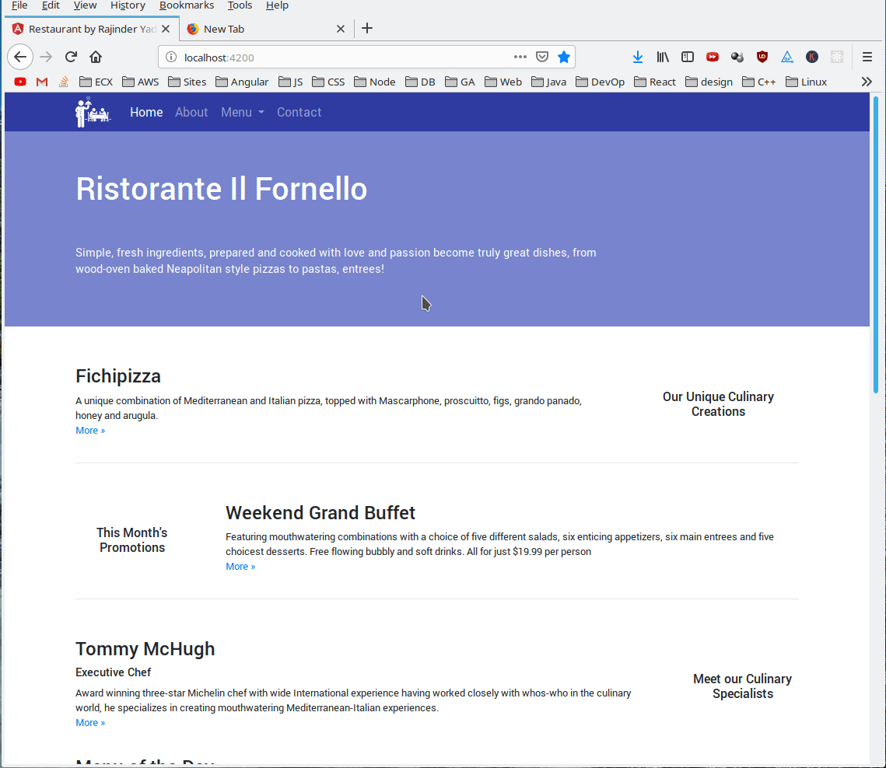

# Angular 7 Assignment

## Instruction

1. Starting with index.html, create a homepage that look like the attached visual (visual.png), using Angular 2+, Bootstrap and CSS3.
1. Add a row after “Meet our Culinary Specialists” that displays the restaurant’s menu in a grid. Demonstrate data binding to an array of JSON objects.

